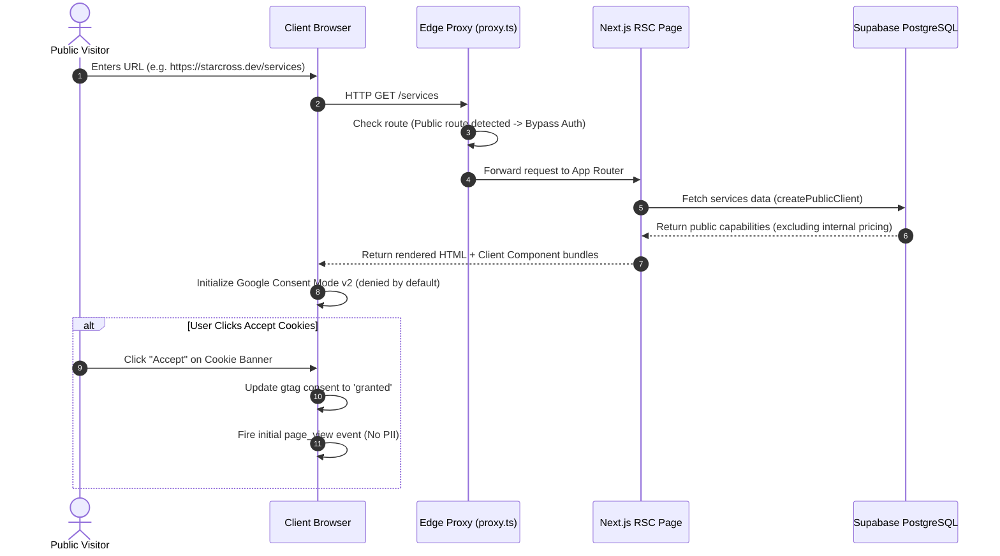
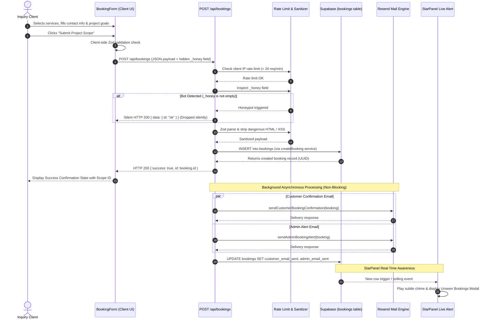
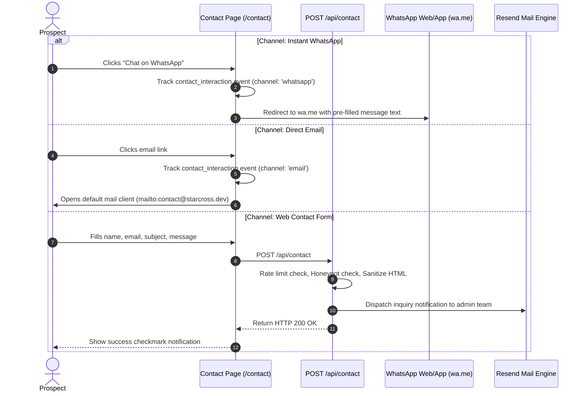
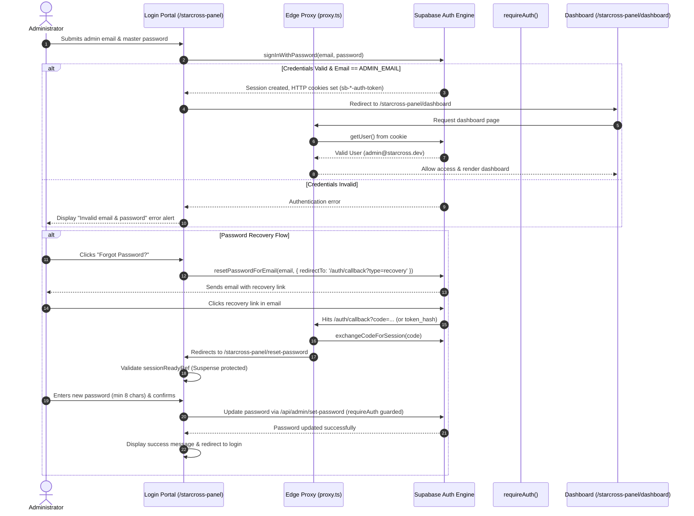
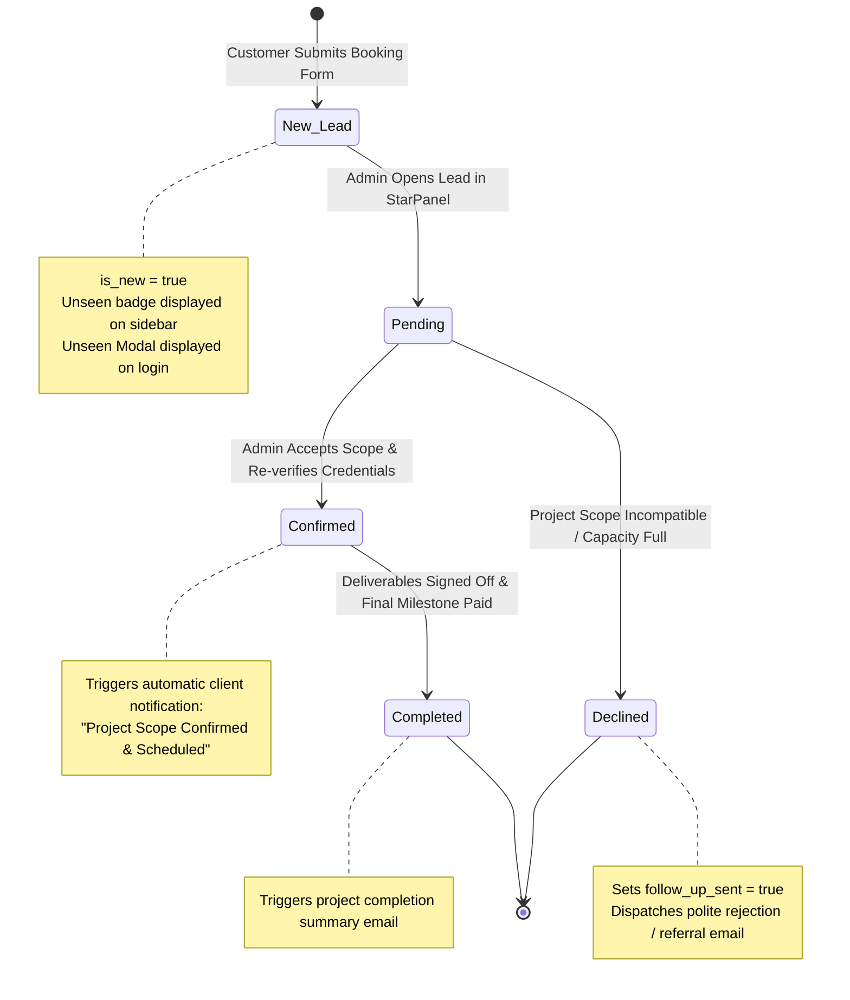
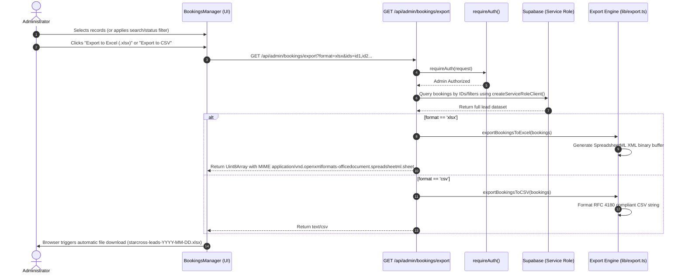
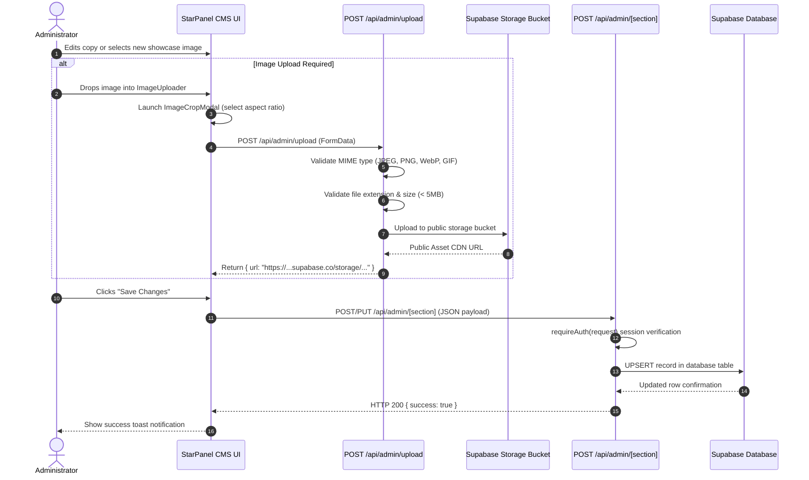
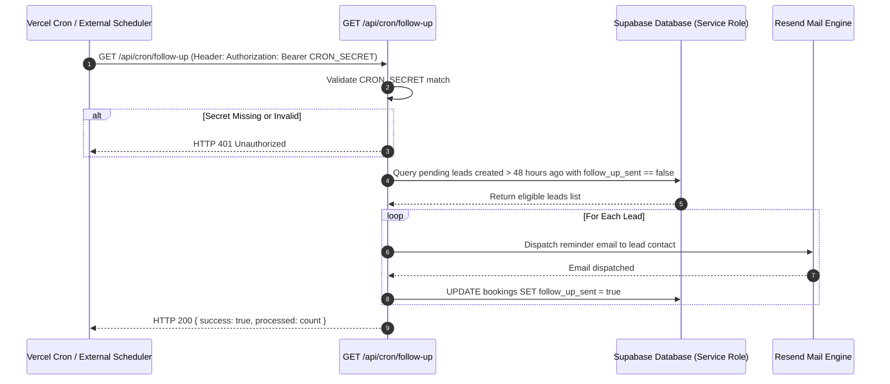

# STARCROSS — System Architecture & Operational Workflows

> **Version:** 2.0.0 (Production Ready)  
> **Framework:** Next.js 16.3.4 (App Router, Turbopack, React 19)  
> **Database & Auth:** Supabase (PostgreSQL 15+, Row-Level Security, Supabase Auth SSR)  
> **Email Delivery:** Resend API  
> **Privacy & Analytics:** Google Consent Mode v2, Google Analytics 4, Vercel Analytics  
> **Testing Suite:** Playwright Chromium E2E, Node Test Runner, TypeScript Typecheck  

---

## Table of Contents
1. [System Overview](#1-system-overview)
2. [High-Level Architecture Diagram](#2-high-level-architecture-diagram)
3. [Technology Stack & Dependencies](#3-technology-stack--dependencies)
4. [Repository Directory Blueprint](#4-repository-directory-blueprint)
5. [Core Architectural Layers](#5-core-architectural-layers)
   - [5.1 Edge Proxy & Perimeter Security](#51-edge-proxy--perimeter-security)
   - [5.2 Presentation & UI/UX Layer](#52-presentation--uiux-layer)
   - [5.3 API & Ingestion Layer](#53-api--ingestion-layer)
   - [5.4 Administrative Management Layer (StarPanel)](#54-administrative-management-layer-starpanel)
   - [5.5 Persistence & Database Engine Layer](#55-persistence--database-engine-layer)
   - [5.6 Asynchronous Notification & Email Engine](#56-asynchronous-notification--email-engine)
   - [5.7 Privacy & Analytics Layer](#57-privacy--analytics-layer)
6. [Operational Workflows](#6-operational-workflows)
   - [Workflow 1: Public Visitor Experience](#workflow-1-public-visitor-experience)
   - [Workflow 2: Client Project Intake & Booking Lifecycle](#workflow-2-client-project-intake--booking-lifecycle)
   - [Workflow 3: Contact & Instant Communication Channels](#workflow-3-contact--instant-communication-channels)
   - [Workflow 4: Administrator Authentication & Password Reset](#workflow-4-administrator-authentication--password-reset)
   - [Workflow 5: Lead Management & CRM Status Transitions](#workflow-5-lead-management--crm-status-transitions)
   - [Workflow 6: Data Export Workflow (CSV & Excel XLSX)](#workflow-6-data-export-workflow-csv--excel-xlsx)
   - [Workflow 7: Content Management System (CMS) Pipeline](#workflow-7-content-management-system-cms-pipeline)
   - [Workflow 8: Automated Follow-Up Cron Routine](#workflow-8-automated-follow-up-cron-routine)
7. [Security, Protection & Compliance Blueprint](#7-security-protection--compliance-blueprint)
8. [Quality Assurance & Verification Protocols](#8-quality-assurance--verification-protocols)
9. [Environment & Deployment Specifications](#9-environment--deployment-specifications)

---

## 1. System Overview

**Starcross** is an enterprise-grade digital solutions agency platform engineered for high-performance service presentation, high-conversion project inquiry intake, and administrative client lifecycle management.

The system combines:
1. **Public Brand Platform**: Fast, SEO-optimized, responsive web application delivering dynamic case studies, capabilities showcase, interactive scoping tools, and direct messaging channels.
2. **Intake & Validation Pipeline**: Zero-trust client intake system with Honeypot bot mitigation, IP rate limiting, input sanitization (XSS stripping), and asynchronous transactional email dispatch.
3. **StarPanel Administrative Portal**: Secured control center for lead pipeline management, real-time lead notification modals, multi-format reporting exports, and live CMS controls over all content sections.
4. **Data Security Engine**: Hardened PostgreSQL database protected by database-level Row Level Security (RLS), column-level pricing restrictions, and service role segregation.

---

## 2. High-Level Architecture Diagram

```mermaid
flowchart TD
    subgraph Clients["Clients & Traffic Sources"]
        Visitor["Public Visitor\n(Desktop/Mobile)"]
        Client["Inquiry Customer\n(Booking/Contact)"]
        AdminUser["System Administrator\n(StarPanel)"]
        CronBot["Vercel Cron / Scheduler\n(Bearer Auth)"]
    end

    subgraph Perimeter["Perimeter & Edge Security"]
        Proxy["Next.js Edge Proxy (proxy.ts)\n- Cookie & Bearer JWT Validation\n- Route Guarding (/starcross-panel, /api/admin)\n- Security Headers (HSTS, CSP, XFO)"]
        RateLimiter["In-Memory Rate Limiter\n- 20 req/min per IP\n- Automatic Eviction"]
        Sanitizer["Sanitization & Honeypot\n- XSS HTML Stripping\n- Honeypot (_honey) Trap"]
    end

    subgraph AppRouter["Next.js App Router (16.3.4)"]
        PublicPages["Public Pages (RSC + Client Islands)\n- Home (/)\n- Services (/services)\n- Projects (/projects)\n- Team (/team)\n- FAQ (/faq)\n- Booking (/booking)\n- Contact (/contact)"]
        PublicAPIs["Public API Handlers\n- POST /api/bookings\n- POST /api/contact"]
        AdminPortal["Admin StarPanel UI\n- /starcross-panel/dashboard\n- /starcross-panel/bookings\n- /starcross-panel/services\n- /starcross-panel/projects\n- /starcross-panel/team\n- /starcross-panel/testimonials\n- /starcross-panel/faq\n- /starcross-panel/settings\n- /starcross-panel/hero"]
        AdminAPIs["Admin API Endpoints (/api/admin/*)\n- bookings, dashboard, export, upload\n- CMS endpoints (hero, services, etc.)\n- set-password, unseen"]
        CronAPI["Cron Endpoint\n- GET /api/cron/follow-up"]
    end

    subgraph Services["Service Layer (services/*)"]
        BookingsSvc["bookings.ts"]
        DashboardSvc["dashboard.ts"]
        ServicesSvc["services.ts"]
        ProjectsSvc["projects.ts"]
        TeamSvc["team.ts"]
        FaqsSvc["faqs.ts"]
        SettingsSvc["settings.ts"]
        HeroSvc["hero.ts"]
    end

    subgraph Persistence["Database & Storage (Supabase)"]
        Postgres[(PostgreSQL 15+\n- Row Level Security (RLS)\n- is_admin() Auth Checks\n- Column Security on starting_price)]
        StorageBucket["Supabase Storage Bucket\n- Public Project & Team Assets\n- MIME & Extension Whitelisted"]
        AuthService["Supabase Auth Engine\n- MagicLink, OTP, Recovery\n- Session Cookie Management"]
    end

    subgraph Integrations["Third-Party Integrations"]
        ResendAPI["Resend Email API\n- Client Confirmations\n- Admin Alerts\n- Status Updates"]
        AnalyticsEngines["Analytics & Privacy\n- Google Analytics 4 (Consent Mode v2)\n- Vercel Analytics (PII Stripped)"]
    end

    Visitor -->|HTTPS| Proxy
    Client -->|Form Submit| Proxy
    AdminUser -->|Admin Access| Proxy
    CronBot -->|Bearer Secret| Proxy

    Proxy --> PublicPages
    Proxy --> RateLimiter
    RateLimiter --> Sanitizer
    Sanitizer --> PublicAPIs
    Proxy --> AdminPortal
    Proxy --> AdminAPIs
    Proxy --> CronAPI

    PublicPages --> ServicesSvc & ProjectsSvc & TeamSvc & FaqsSvc & SettingsSvc & HeroSvc
    PublicAPIs --> BookingsSvc
    AdminAPIs --> BookingsSvc & DashboardSvc & ServicesSvc & ProjectsSvc
    CronAPI --> BookingsSvc

    BookingsSvc --> Postgres
    ServicesSvc --> Postgres
    ProjectsSvc --> Postgres
    AdminAPIs --> StorageBucket
    Proxy & AdminPortal --> AuthService

    BookingsSvc -.->|Async Non-Blocking| ResendAPI
    PublicPages -.->|Consent Granted| AnalyticsEngines
```

---

## 3. Technology Stack & Dependencies

| Layer | Technology | Version | Purpose |
| :--- | :--- | :--- | :--- |
| **Core Framework** | Next.js (App Router, Turbopack) | `16.3.4` | Modern server/client hybrid web application framework |
| **Runtime & UI Library** | React & React DOM | `19.2.8` | Component rendering, React Server Components (RSC) |
| **Language** | TypeScript | `^5.0.0` | Strict static typing across models, APIs, and components |
| **Styling & CSS** | Tailwind CSS & PostCSS | `^4.0.0` | Utility-first styling with modern CSS variables |
| **Animations** | Framer Motion | `^13.2.0` | Micro-interactions, staggered entrances, transitions |
| **Database & Auth** | Supabase SSR & JS SDK | `^0.12.6` / `^2.115.0` | PostgreSQL with RLS, Auth SSR cookies, storage management |
| **Email Service** | Resend SDK | `^6.26.0` | Transactional client confirmations, admin notifications |
| **Validation** | Zod | `^4.5.4` | Strict runtime schema parsing and error validation |
| **Forms** | React Hook Form & Resolvers | `^7.87.0` / `^5.9.1` | Performant, accessible form state management |
| **Analytics** | Vercel Analytics & GA4 | `^2.0.1` | Privacy-centric dual event tracking with Google Consent Mode v2 |
| **Document Export** | Native SpreadsheetML & PDF | Built-in | Secure, dependency-free Excel (.xlsx) & CSV generation |
| **Testing** | Playwright & TSX | `^1.50.0` / `^4.23.13` | Headless & real browser automation across all viewports |

---

## 4. Repository Directory Blueprint

```
starcross/
├── app/                                 # Next.js App Router root
│   ├── layout.tsx                       # Root layout with fonts, analytics & cookie banner
│   ├── page.tsx                         # Homepage (Hero, Trust, Services, Work, CTA)
│   ├── booking/page.tsx                 # Project intake portal with Suspense wrapper
│   ├── contact/page.tsx                 # Contact channels, form, WhatsApp quick link
│   ├── services/page.tsx                # Detailed engineering services catalog
│   ├── projects/page.tsx                # Portfolio showcase & case studies
│   ├── team/page.tsx                    # Systems architects & leadership directory
│   ├── faq/page.tsx                     # Searchable, categorized FAQ accordion
│   ├── privacy/page.tsx                 # Privacy Policy (GDPR / ePrivacy)
│   ├── terms/page.tsx                   # Terms of Service & Scoping agreements
│   ├── refund/page.tsx                  # Refund & Milestone Payment policy
│   ├── robots.ts                        # Crawler directives (disallows /starcross-panel)
│   ├── sitemap.ts                       # Dynamic XML sitemap generator
│   ├── auth/callback/route.ts           # Supabase Auth PKCE / OTP exchange callback
│   ├── api/
│   │   ├── bookings/route.ts            # Public booking creation (Rate limit, honeypot, DB, email)
│   │   ├── contact/route.ts             # Public contact inquiry endpoint
│   │   ├── cron/follow-up/route.ts      # Automated lead follow-up cron (Bearer secret guard)
│   │   └── admin/                       # Strict Admin-only API endpoints
│   │       ├── bookings/route.ts        # GET, PATCH, PUT booking leads
│   │       ├── bookings/export/route.ts # CSV & Excel XLSX export generator
│   │       ├── bookings/unseen/route.ts # Real-time unseen inquiry counter
│   │       ├── dashboard/route.ts       # Aggregated KPIs and trend metrics
│   │       ├── hero/route.ts            # Hero section CMS controller
│   │       ├── services/route.ts        # Services capabilities CMS controller
│   │       ├── projects/route.ts        # Projects portfolio CMS controller
│   │       ├── team/route.ts            # Team members CMS controller
│   │       ├── testimonials/route.ts    # Testimonials & reviews CMS controller
│   │       ├── faq/route.ts             # FAQ items CMS controller
│   │       ├── settings/route.ts        # Global site settings & socials controller
│   │       ├── set-password/route.ts    # Admin credential reset endpoint
│   │       └── upload/route.ts          # MIME/extension-validated file upload handler
│   └── starcross-panel/                 # StarPanel Administrative UI
│       ├── page.tsx                     # Admin Portal Login with Suspense boundary
│       ├── layout.tsx                   # Admin shell layout with Auth guard & sidebar
│       ├── dashboard/page.tsx           # Real-time metrics, trend charts, recent bookings
│       ├── bookings/page.tsx            # Full CRM bookings manager (search, filter, sort, edit)
│       ├── reset-password/page.tsx      # Recovery session token password reset portal
│       ├── hero/page.tsx                # Landing hero CMS editor
│       ├── services/page.tsx            # Services CMS manager
│       ├── projects/page.tsx            # Projects CMS manager
│       ├── team/page.tsx                # Team roster CMS manager
│       ├── testimonials/page.tsx        # Testimonials CMS manager
│       ├── faq/page.tsx                 # FAQ items CMS manager
│       └── settings/page.tsx            # Global configurations & brand assets
├── components/                          # Modular React components
│   ├── admin/                           # StarPanel specific components
│   │   ├── admin-login-form.tsx         # Password & MFA login card
│   │   ├── admin-panel-shell.tsx        # Admin navigation & live sync wrapper
│   │   ├── dashboard-metrics.tsx        # KPI summary metric cards
│   │   ├── dashboard-trend-chart.tsx    # Monthly volume visual graph
│   │   ├── bookings/                    # Bookings manager, detail modal, unseen lead modal
│   │   └── cms/                         # Image uploader, crop modal, form editors
│   ├── analytics/                       # AnalyticsProvider, CookieConsentBanner, TrackedLink
│   ├── animations/                      # FadeIn, StaggerContainer, StaggerItem
│   ├── booking/                         # Multi-service interactive booking form
│   ├── contact/                         # Interactive contact message form
│   ├── faq/                             # Animated FAQ accordion
│   ├── layout/                          # Navbar, AdminHeader, Footer, MobileNav
│   └── ui/                              # Atoms: Button, Input, Textarea, Card, Modal, Spinner, Icons
├── hooks/                               # Custom React hooks (useMounted, useMediaQuery)
├── lib/                                 # Shared infrastructure & utilities
│   ├── analytics/                       # Consent management & zero-PII event tracking
│   ├── auth/guards.ts                   # Unified requireAuth guard (Cookie + Bearer JWT)
│   ├── export.ts                        # Native SpreadsheetML & CSV generator
│   ├── rate-limit.ts                    # IP rate limiter with auto memory eviction
│   ├── sanitize.ts                      # HTML sanitization & Honeypot detection
│   ├── supabase/                        # Browser, Server, Public, and Service Role clients
│   ├── resend/emails.ts                 # Transactional HTML & text email templates
│   └── validations/schemas.ts           # Zod schemas for forms, admin ops, status changes
├── proxy.ts                             # Next.js 16 Edge proxy (Perimeter route protection)
├── services/                            # Decoupled Data Access Object (DAO) services
├── supabase/                            # Database migrations & SQL seed definitions
└── scripts/                             # Test automation suites (RLS, E2E, Admin, Browser)
```

---

## 5. Core Architectural Layers

### 5.1 Edge Proxy & Perimeter Security
- **File:** [`proxy.ts`](./proxy.ts)
- **Functions:**
  - Evaluates all inbound requests before route dispatch.
  - Bypasses public pages (`/`, `/services`, `/booking`, etc.) immediately for fast static delivery.
  - Intercepts unauthenticated `/starcross-panel/**` visits (excluding the login page and password reset page) and issues an `HTTP 307` redirect to `/starcross-panel?redirected=1`.
  - Intercepts unauthorized `/api/admin/**` visits, verifying both cookie-based sessions and `Authorization: Bearer <jwt>` tokens. Rejects unauthenticated calls with `401 Unauthorized` and non-whitelisted emails with `403 Forbidden`.
  - Injects OWASP security headers (`X-Frame-Options: DENY`, `X-Content-Type-Options: nosniff`, HSTS, `Referrer-Policy`, and restrictive `Permissions-Policy`).

### 5.2 Presentation & UI/UX Layer
- **Architecture:** Hybrid React Server Components (RSC) with Client Component interactivity islands.
- **Styling:** Tailwind CSS v4 design system utilizing curated HSL color palettes, luxury glassmorphic surfaces (`backdrop-blur-xl`), smooth border transitions, and responsive typography (`clamp()`).
- **Animations:** Framer Motion staggered entrances and smooth height accordions.
- **Responsiveness:** Fluid grid layouts engineered to display with 0px overflow across 9 distinct device breakpoints (320px, 375px, 425px, 768px, 1024px, 1366px, 1440px, 1920px, 2560px).

### 5.3 API & Ingestion Layer
- **Endpoints:**
  - `POST /api/bookings`: Client project intake with Zod parsing, honeypot evasion, database insertion, and asynchronous confirmation email dispatch.
  - `POST /api/contact`: General client contact message submission.
  - `GET /api/cron/follow-up`: Automated email reminder daemon guarded by `CRON_SECRET`.
- **Defenses:**
  - In-memory rate limiting bounding IP requests to 20 per minute.
  - Deep string sanitization stripping script tags, malicious HTML, and CRLF email header injection vectors.

### 5.4 Administrative Management Layer (StarPanel)
- **Guard:** Protected by [`lib/auth/guards.ts`](./lib/auth/guards.ts) and edge proxy.
- **Capabilities:**
  - **Live Leads Pipeline**: Real-time polling and badge notification of incoming inquiries.
  - **Lead Management**: Status transitions (`pending` → `confirmed` → `completed` → `declined`), notes, and budget management.
  - **Export Engine**: Export filtered lead selections to CSV, Excel (`.xlsx`), or PDF.
  - **Live CMS Controls**: Visual WYSIWYG management of Hero copy, Services, Portfolio case studies, Team members, Testimonials, FAQs, and Site Settings.
  - **Asset Uploader**: MIME-type and extension-validated image upload with integrated cropping modal.

### 5.5 Persistence & Database Engine Layer
- **Database:** Supabase PostgreSQL 15+.
- **Security:**
  - Row Level Security (RLS) is explicitly **ENABLED** and **FORCED** across all 8 tables (`hero_section`, `services`, `projects`, `team_members`, `testimonials`, `faqs`, `site_settings`, `bookings`).
  - `is_admin()` SQL security definition checks `service_role`, `app_metadata ->> 'role' = 'admin'`, and whitelisted administrator contact email.
  - Column-Level Security: `starting_price` column in `services` is revoked from public roles, exposing sanitized public data via `public_services` view while restricting pricing mutations to authorized administrators.
  - Public anonymous users can only `INSERT` bookings; all `SELECT`, `UPDATE`, and `DELETE` queries on bookings require `is_admin()`.

### 5.6 Asynchronous Notification & Email Engine
- **Provider:** Resend API.
- **Reliability Pattern (Non-Blocking):**
  - Database writes always succeed independently of external mail server latency or rate limits.
  - Inquiries are saved to PostgreSQL first, followed by background asynchronous execution of `sendCustomerBookingConfirmation` and `sendAdminBookingAlert`.
  - Delivery outcomes are recorded back to database flags (`customer_email_sent`, `admin_email_sent`).
  - Automated status updates trigger personalized follow-up emails to clients when administrators update a lead in StarPanel.

### 5.7 Privacy & Analytics Layer
- **Compliance:** Full GDPR, CCPA, and ePrivacy directive compliance.
- **Architecture:**
  - Implements **Google Consent Mode v2**: defaults `analytics_storage` and `ad_storage` to `'denied'`.
  - Respects browser **Do Not Track** (`navigator.doNotTrack === '1'`).
  - Luxury glassmorphic Cookie Consent Banner stores explicit preference (`'granted'` or `'denied'`) in `localStorage`.
  - Zero-PII event dispatcher strips all client names, emails, phone numbers, and message content prior to transmission to GA4 and Vercel Analytics.
  - Admin Isolation: Automatically silences tracking for `/starcross-panel/**` routes.

---

## 6. Operational Workflows

### Workflow 1: Public Visitor Experience



---

### Workflow 2: Client Project Intake & Booking Lifecycle



---

### Workflow 3: Contact & Instant Communication Channels



---

### Workflow 4: Administrator Authentication & Password Reset



---

### Workflow 5: Lead Management & CRM Status Transitions



---

### Workflow 6: Data Export Workflow (CSV & Excel XLSX)



---

### Workflow 7: Content Management System (CMS) Pipeline



---

### Workflow 8: Automated Follow-Up Cron Routine



---

## 7. Security, Protection & Compliance Blueprint

| Security Domain | Implementation Architecture | Target Threat Mitigated |
| :--- | :--- | :--- |
| **Edge Perimeter Defense** | `proxy.ts` verifies route tokens before App Router execution | Unauthorized access, path traversal, crawl indexing |
| **Authentication & RBAC** | Supabase Auth SSR cookies + Bearer JWT extraction in `requireAuth` | Credential stuffing, broken object-level authorization |
| **Database Isolation** | PostgreSQL Row-Level Security (RLS) forced on all 8 tables | SQL injection, direct table read privilege escalation |
| **Pricing Confidentiality** | `starting_price` column revoked from anon/auth roles; exposed only via secure RPC | Competitive scraping, data harvesting |
| **Bot Mitigation** | Hidden honeypot field (`_honey`) in booking & contact forms | Automated spam bots, form flooding |
| **Volumetric Defense** | In-memory token bucket rate limiter (20 requests/minute per IP) | Denial of service (DoS), brute force submissions |
| **Cross-Site Scripting (XSS)** | Recursive HTML entity stripping and tag removal in `sanitize.ts` | Stored XSS, reflected DOM injection |
| **Email Header Injection** | Strict CRLF newline sanitization on sender and recipient fields | SMTP command injection, email relay hijacking |
| **File Upload Hardening** | MIME whitelist, extension whitelist, 5MB file size limit | Remote code execution, SVG script injection |
| **Sort Order Injection** | Strict allowlist Set validation on query parameter sorting columns | SQL order-by injection attacks |
| **Security Headers** | `X-Frame-Options: DENY`, `nosniff`, strict HSTS, `Referrer-Policy` | Clickjacking, MIME-sniffing, protocol downgrade |
| **User Privacy & GDPR** | Google Consent Mode v2, localStorage consent persistence, PII stripping | Regulatory non-compliance, unauthorized tracking |

---

## 8. Quality Assurance & Verification Protocols

The Starcross codebase includes 5 automated verification suites. All suites must pass with 0 errors before staging or production deployments.

### 1. Database Row Level Security Suite
Verifies that RLS is active on all 8 tables, `is_admin()` evaluates properly, and public permissions are locked down.
```bash
npm run test:rls
# Expected Result: 56/56 security checks passed
```

### 2. Public, Security Headers & Ingestion Suite
Probes all public routes, OWASP security headers, unauthorized redirect interception, bot honeypots, and input validation.
```bash
npx tsx scripts/e2e-qa-test.ts
# Expected Result: 44/44 checks passed
```

### 3. Authenticated Admin & CRUD Operations Suite
Validates administrative JWT authentication, dashboard analytics, bookings CRM filtering, status updates, CSV/Excel export, CMS routes, and cron routines.
```bash
npx tsx scripts/test-admin-e2e.ts
# Expected Result: 15/15 checks passed
```

### 4. Interactive Google Chrome Browser QA Suite
Drives real Google Chrome on Windows via Playwright to verify DOM rendering, FAQ accordion interaction, booking form inputs, and mobile responsiveness.
```bash
npx tsx scripts/browser-qa-suite.ts
# Expected Result: 18/18 checks passed, screenshots generated
```

### 5. Multi-Viewport Responsive Layout & Overflow Audit
Audits all 9 responsive device viewports (320px, 375px, 425px, 768px, 1024px, 1366px, 1440px, 1920px, 2560px) across all public and administrative interfaces.
```bash
npx tsx scripts/responsive-audit.ts
# Expected Result: 0px overflow across all viewports
```

### 6. Static Analysis & Production Compilation
```bash
# Static linter check:
npm run lint
# Expected Result: 0 errors, 0 warnings

# TypeScript strict type check:
npx tsc --noEmit
# Expected Result: 0 errors

# Production build compilation:
npm run build
# Expected Result: 32/32 routes prerendered cleanly
```

---

## 9. Environment & Deployment Specifications

### Required Environment Variables (`.env.local`)

```env
# ============================================================
# STARCROSS — Production Environment Configuration
# ============================================================

# Supabase Infrastructure
NEXT_PUBLIC_SUPABASE_URL=https://<your-project-ref>.supabase.co
NEXT_PUBLIC_SUPABASE_ANON_KEY=<your-anon-public-key>
SUPABASE_SERVICE_ROLE_KEY=<your-service-role-private-key>

# Transactional Email (Resend)
RESEND_API_KEY=re_xxxxxxxxxxxxxxxxx
RESEND_FROM_EMAIL=onboarding@resend.dev

# Administrative Lockdown
ADMIN_EMAIL=admin@starcross.dev

# Automated Cron Daemon Secret
CRON_SECRET=<secure-random-token-32-chars>

# Privacy & Analytics
NEXT_PUBLIC_GA_MEASUREMENT_ID=G-XXXXXXXXXX
NEXT_PUBLIC_ANALYTICS_ENABLED=true

# Canonical Site URL
NEXT_PUBLIC_SITE_URL=https://starcross.dev
```

### Vercel Deployment Checklist
1. Connect Git repository to **Vercel**.
2. Configure all environment variables in **Project Settings > Environment Variables**.
3. Set Node.js version to **20.x** or **22.x**.
4. Configure Cron job in `vercel.json`:
   ```json
   {
     "crons": [
       {
         "path": "/api/cron/follow-up",
         "schedule": "0 9 * * *"
       }
     ]
   }
   ```
5. Deploy production build. Verify edge proxy and SSL certificates.
